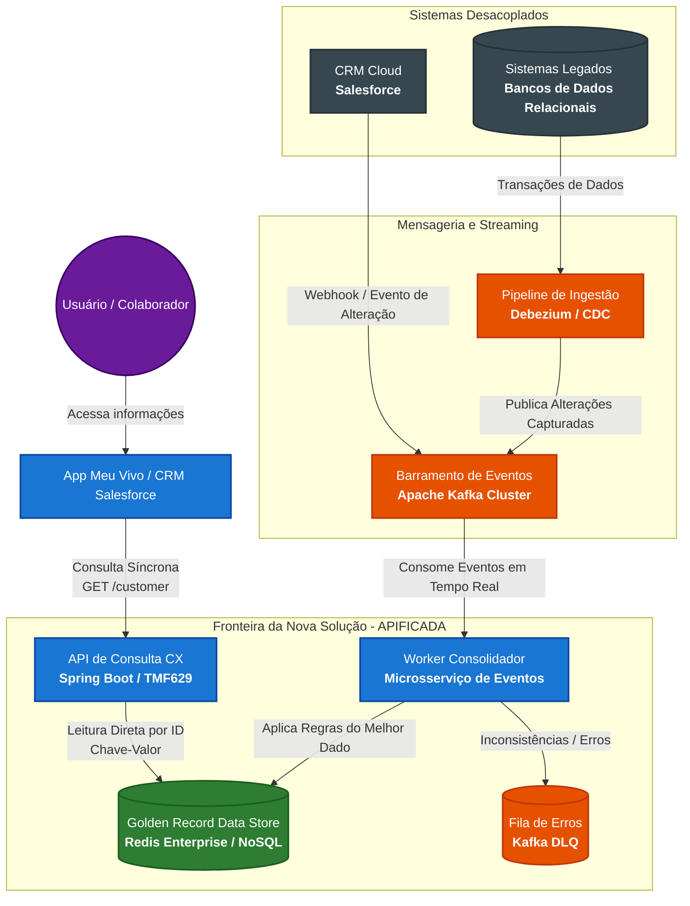

# ADR 001: Consolidação do Cadastro de Clientes/Colaboradores (Ponto Único de Consulta)

## Status
Proposto

## Contexto
Atualmente, as informações cadastrais de clientes e colaboradores da Vivo coexistem e são alteradas em múltiplos sistemas, incluindo o CRM de mercado (Salesforce) e diversos sistemas legados. A área de Atendimento (CX) demanda uma visão unificada ("melhor dado") que possa ser consultada de forma centralizada. 

Os principais desafios técnicos e arquiteturais são:
1. **Baixíssima Latência:** O tempo de resposta da API de consulta precisa ser inferior a milissegundos (< 1ms para cache ou poucos milissegundos em regime de leitura).
2. **Desacoplamento Total:** O sistema de consulta não deve possuir acoplamento com as origens (Salesforce e legados).
3. **Consistência e Sincronismo:** Alterações em qualquer ponta devem refletir de forma automatizada no ponto central.
4. **Resiliência:** Falhas e indisponibilidades nos sistemas legados não podem afetar a disponibilidade da API de consulta de CX.
5. **Padronização:** A solução deve seguir o modelo "apificado" orientado aos domínios de telecomunicações.

## Decisão
Decidimos adotar uma **Arquitetura Orientada a Eventos (EDA)** baseada no padrão **CQRS (Command Query Responsibility Segregation)**, utilizando uma camada de **Change Data Capture (CDC)** para ingestão e um banco de dados NoSQL de alta performance em memória para servir como o *Golden Record Data Store*.

### Componentes Tecnológicos Escolhidos:
* **Ingestão via CDC:** Utilização do **Debezium** acoplado aos bancos de dados dos sistemas legados para capturar eventos de inserção e atualização em tempo real, sem onerar as aplicações legadas.
* **Mensageria e Streaming:** **Apache Kafka (Confluent)** como o broker central de eventos para garantir o transporte assíncrono, distribuído e persistente das alterações de dados.
* **Camada de Processamento (Workers):** Microsserviços desenvolvidos em **Spring Boot (Java)** ou **NestJS** responsáveis por consumir os tópicos do Kafka, tratar concorrências, enriquecer o dado e aplicar as regras de negócio para salvar o "melhor dado".
* **Armazenamento de Consulta (Ponto Único):** Banco de dados **Redis Enterprise** (ou **Amazon DynamoDB** com DAX) atuando como base NoSQL de chave-valor em memória.
* **Resiliência de Código:** Framework **Resilience4j** implementando padrões de *Circuit Breaker* e *Retry* nos microsserviços, associado ao uso de **Dead Letter Queues (DLQ)** no Kafka para isolamento de mensagens corrompidas.
* **Padronização de API:** Implementação baseada na especificação **TMF629 (Customer Management API)** do **TM Forum** no domínio de *Party*.

## Consequências

### Positivas (+):
* **Desempenho Extremo:** A leitura direta no Redis por chave (ID/CPF) garante tempos de resposta na casa dos microsegundos, atendendo com folga o requisito de negócio.
* **Acoplamento Zero:** Os sistemas legados e o Salesforce publicam seus dados e atualizações de forma assíncrona; eles não conhecem a existência da API de consulta e vice-versa.
* **Alta Disponibilidade e Resiliência:** Se um sistema legado ficar offline, o barramento do Kafka retém os eventos. A API de consulta de CX continua funcionando normalmente e servindo os dados já consolidados.
* **Alinhamento com Padrões Globais:** O uso das OpenAPIs do TM Forum garante conformidade com as melhores práticas mundiais de arquitetura para Telecomunicações (Telco).

### Negativas (-):
* **Consistência Eventual:** Como o fluxo de consolidação é assíncrono, há um pequeno *delay* (geralmente de milissegundos) entre a alteração no sistema de origem e o reflexo no ponto único de consulta.
* **Complexidade Operacional:** A introdução de componentes como Kafka, clusters Redis e pipelines de CDC eleva a complexidade de monitoramento (observabilidade), exigindo ferramentas robustas como Prometheus, Grafana e OpenTelemetry.

## Notas de Implementação
* O desenho detalhado dos contêineres e componentes seguirá estritamente a metodologia **C4 Model** (Níveis 1 e 2) na documentação complementar.


## Diagrama de Arquitetura (C4 Model - Nível 2: Contêineres)

O diagrama abaixo ilustra as fronteiras da solução proposta, o desacoplamento absoluto dos sistemas legados/cloud através do barramento de eventos, e a API de consulta consumindo o repositório consolidado em memória.




## 5. Diagrama da Arquitetura de Solução (C4 Model - Nível 2)

O diagrama abaixo ilustra a separação em camadas da arquitetura proposta. Ele destaca os fluxos de consulta síncronos (< 5ms) protegidos por cache-hit e o fluxo de ingestão e consolidação assíncrona orientada a eventos (EDA).

```mermaid
graph TD
    %% Estilos Globais
    classDef canais fill:#ffffff,stroke:#00a1e4,color:#000,stroke-width:2px;
    classDef exposicao fill:#ffffff,stroke:#006699,color:#000,stroke-width:2px;
    classDef consulta fill:#e8f5e9,stroke:#2e7d32,color:#000,stroke-width:2px;
    classDef ingestao fill:#fff3e0,stroke:#e65100,color:#000,stroke-width:2px;
    classDef origens fill:#f5f5f5,stroke:#37474f,color:#000,stroke-width:2px;
    classDef db fill:#ffffff,stroke:#1b5e20,color:#000,stroke-width:1px;
    classDef kafka fill:#ffffff,stroke:#bf360c,color:#000,stroke-width:1px;

    %% CAMADA DE CANAIS / CONSUMIDORES
    subgraph CamadaCanais [CAMADA DE CANAIS / CONSUMIDORES]
        %% % CAMADA DE CANAIS / CONSUMIDORES
subgraph CamadaCanais [CAMADA DE CANAIS / CONSUMIDORES]
    MeuVivo ["App Meu Vivo <br><i>(Mobile Native)</i>"]:::canais
    CrmAgente ["CRM do Agente / Web Portal <br><i>(Web Application)</i>"]:::canais
    end

    %% CAMADA DE EXPOSIÇÃO E GOVERNANÇA
    subgraph CamadaExposicao [CAMADA DE EXPOSIÇÃO E GOVERNANÇA (API MANAGEMENT)]
        ApiGateway[WSO2 API Manager / Kong Gateway <br><b>[OAuth2 / OIDC | Rate Limiting | Open API TM Forum TMF629 & TMF632]</b>]:::exposicao
    end

    %% CAMADA DE CONSULTA (READ MODEL)
    subgraph CamadaConsulta [CAMADA DE CONSULTA (READ MODEL)]
        QueryApi[Customer-Query-API <br><i>(Spring Boot / Go - Microservice)</i>]:::consulta
        Redis[Redis Cluster <br><i>(In-Memory Cache < 5ms)</i>]:::db
        Mongo[MongoDB / DocumentDB <br><i>(Single View 360°)</i>]:::db
    end

    %% CAMADA DE INGESTÃO E EVENTOS (EDA)
    subgraph CamadaIngestao [CAMADA DE INGESTÃO E EVENTOS (EDA)]
        SyncWorker[Customer-Sync-Worker <br><i>(Merge & Deduplication Service)</i>]:::ingestao
        Kafka[Apache Kafka Cluster <br><i>(Topics: customer.events / DLQ)</i>]:::kafka
        CdcLegados[Debezium CDC <br><i>(Legados)</i>]:::ingestao
        CdcCloud[Debezium CDC <br><i>(Cloud Services)</i>]:::ingestao
    end

    %% SISTEMAS LEGADOS e CLOUD
    subgraph SistemasLegados [SISTEMAS LEGADOS (ON-PREMISES)]
        OracleDB[Oracle DB / Mainframe <br><i>(Reads WAL / Redo Logs)</i>]:::origens
    end

    subgraph SistemasCloud [SISTEMAS CLOUD (MULTI-CLOUD)]
        PostgresCloud[PostgreSQL / Cloud Services <br><i>(Reads CDC / Change Logs)</i>]:::origens
    end

    %% Relacionamentos e Fluxos
    MeuVivo -->|REST| ApiGateway
    CrmAgente -->|REST| ApiGateway
    
    ApiGateway -->|TMF629 / TMF632| QueryApi
    
    QueryApi -->|Cache Hit| Redis
    QueryApi -->|Cache Miss| Mongo
    
    SyncWorker -.->|Update Async| Redis
    SyncWorker -.->|Update Async| Mongo
    SyncWorker -->|Consume| Kafka
    
    Kafka <--|Streaming| CdcLegados
    Kafka <--|Streaming| CdcCloud
    
    CdcLegados -.->|Leitura de Logs| OracleDB
    CdcCloud -.->|Leitura de Logs| PostgresCloud
```

---

### Detalhamento dos Componentes do Desenho

1. **Camada de Exposição e Governança:** O **API Gateway** unifica a entrada de canais, aplicando segurança jurídica (OAuth2/OIDC) e políticas de tráfego (Rate Limiting) diretamente sob os contratos globais **TMF629** e **TMF632**.
2. **Camada de Consulta (Read Model):** A **Customer-Query-API** implementa a segregação do CQRS. Ela responde requisições de leitura de altíssima performance buscando preferencialmente no **Redis** (latência < 5ms). Em caso de *Cache Miss*, recorre ao **MongoDB/DocumentDB**, que mantém o documento estruturado com a visão unificada de 360° do cliente em formato JSON.
3. **Camada de Ingestão e Eventos (EDA):** A captura de dados é feita de forma não intrusiva pelo **Debezium CDC**, que lê diretamente os logs de transação (Redo/WAL) dos sistemas legados on-premises e cloud, eliminando impactos de CPU e consultas de leitura nas tabelas de produção. O **Customer-Sync-Worker** realiza a limpeza, deduplicação (por CPF/CNPJ) e atualização assíncrona dos modelos de leitura.


## Notas Complementares sobre o Desenho:
1. **Camada de Origem:** O **Salesforce** e os **Sistemas Legados** mudaram de papel. Em vez de receberem requisições diretas de consulta, eles tornaram-se estritamente produtores de dados de maneira assíncrona.
2. **Ingestão Inteligente (CDC):** O **Debezium** elimina a necessidade de alterar os códigos-fonte dos sistemas legados. Ele "escuta" os logs dos bancos de dados e despacha as mudanças para o **Kafka** sem gerar impacto de performance ou acoplamento.
3. **Tratamento do "Melhor Dado":** O componente **Worker Consolidador** isola toda a inteligência e as regras de negócio para resolver conflitos e duplicidades, garantindo que o **Redis** guarde estritamente o dado unificado e sanitizado (*Golden Record*).

## 6. Governança & Padronização TM Forum APIs

A adoção dos padrões abertos da **TM Forum** resolve o desafio de fragmentação de dados no ecossistema de Telecom, fornecendo contratos REST/JSON universais que desconectam o front-end dos esquemas legados proprietários.

A tabela abaixo descreve as OpenAPIs utilizadas, seus respectivos domínios e a função prática na consolidação do "melhor dado":

| API TM Forum | Domínio / Responsabilidade | Recursos & Função Prática |
| :--- | :--- | :--- |
| **TMF629**<br>Customer Management | Papel Comercial do Cliente (Customer Role) | Recurso `/customer`. Gerencia status da conta (Active/Suspended), preferências de contato e vínculo com contas de faturamento. |
| **TMF632**<br>Party Management | Entidade Mestra Real (Individual / Organization) | Recursos `/individual` e `/organization`. Mantém CPF/CNPJ, nome, data de nascimento e documentos oficiais. Base MDM. |
| **TMF637**<br>Product Inventory | Produtos e Serviços Contratados | Recurso `/product`. Mapeia planos, linhas móveis, banda larga, chips e status do catálogo ativo. |
| **TMF666**<br>Account Management | Contas de Faturamento & Cobrança | Recurso `/billingAccount`. Dados de ciclo de faturamento, histórico de faturas e limite de crédito. |

### Impacto na Estratégia de Ingestão e Agregação
O componente **Worker Consolidador** (apresentado no diagrama C4) será responsável por consumir as mensagens brutas originadas no Salesforce e nos sistemas legados e traduzi-las diretamente para o modelo de dados canônico dessas 4 especificações. O resultado consolidado (*Golden Record*) persistido no **Redis** estará pronto para ser exposto nativamente por esses contratos, garantindo uma arquitetura extensível, padronizada mundialmente e de altíssima performance para a camada de CX.

## 7. Mapeamento Técnico de Atributos (Modelo Canônico TMF629)

Para materializar o conceito de "melhor dado" (*Golden Record*) no ponto único de consulta (**Redis**), o **Worker Consolidador** realiza o mapeamento e a higienização dos payloads brutos (Salesforce e Legados) transformando-os na estrutura padronizada da **TMF629**.

Abaixo estão os campos técnicos essenciais mapeados e a estratégia de consolidação para cada um:

### Objeto Principal: `Customer`

*   **`id`** (String)
    *   **Descrição:** Identificador único global do cliente na Vivo.
    *   **Estratégia:** Gerado de forma determinística através de um hash baseado no documento do cliente (ex: CPF/CNPJ), garantindo unicidade indesejada de duplicidade entre origens.
*   **`href`** (String)
    *   **Descrição:** URL de auto-referência para acesso direto ao recurso da API.
    *   **Exemplo:** `https://vivo.com.br`
*   **`status`** (String)
    *   **Descrição:** Estado comercial do cliente no ecossistema.
    *   **Valores Válidos:** `Active`, `Suspended`, `Terminated`.
    *   **Regra de Consolidação:** Se qualquer sistema legado reportar o cliente como ativo com uma linha móvel em funcionamento, o status global será mantido como `Active`.
*   **`statusReason`** (String)
    *   **Descrição:** Justificativa ou motivo do status atual (ex: inadimplência, solicitação do usuário).

### Sub-estruturas e Relacionamentos

#### 1. `validFor` (TimePeriod)
*   **Campos:** `startDateTime` (DateTime), `endDateTime` (DateTime)
*   **Função:** Determina o período de validade jurídica e comercial daquele cadastro de cliente.

#### 2. `engagedParty` (RelatedPartyRef)
*   **Campos:** `id`, `href`, `name`, `@referredType` (Individual / Organization)
*   **Função:** Cria o vínculo direto com a entidade mestra real mapeada na **TMF632**. É aqui que o ID do documento único (CPF/CNPJ) e o nome civil unificado são amarrados ao papel comercial do cliente.

#### 3. `account` (AccountRef)
*   **Campos:** `id`, `description`, `href`, `@referredType` (BillingAccount)
*   **Função:** Lista de referências de contas de faturamento vinculadas ao cliente (mapeadas na **TMF666**). Permite que a camada de CX saiba imediatamente quais faturas e ciclos pertencem àquele perfil sem acoplamento direto.

#### 4. `contactMedium` (Lista de ContactMedium)
*   **Campos:** 
    *   `preferred` (Boolean) - Indicador se é o canal favorito de contato.
    *   `mediumType` (String) - Tipo de contato (ex: `Email`, `Mobile`, `PostalAddress`).
    *   `characteristic` (Objeto) - Contém os dados em si (ex: `emailAddress`, `phoneNumber`, `street1`).
*   **Regra de Consolidação do "Melhor Dado":** O Salesforce (CRM) será considerado a origem de maior prioridade (*source of truth*) para as flags de `preferred`. Caso um sistema legado traga um número de telefone mais recente (validado por data de modificação), o Worker atualiza a lista mantendo o histórico sanitizado.

---

### Exemplo de Payload Consolidado em Memória (Redis / JSON)

Este é o formato de dado de altíssima performance estruturado conforme a especificação que a **API de Consulta CX** lerá do cache instantaneamente:

```json
{
  "id": "VIVO-CUST-89324792",
  "href": "https://vivo.com.br",
  "status": "Active",
  "validFor": {
    "startDateTime": "2024-01-15T08:00:00Z"
  },
  "engagedParty": {
    "id": "12345678900",
    "name": "João da Silva",
    "@referredType": "Individual"
  },
  "account": [
    {
      "id": "ACC-998877",
      "description": "Conta Fatura Combo Móvel + Fibra",
      "@referredType": "BillingAccount"
    }
  ],
  "contactMedium": [
    {
      "preferred": true,
      "mediumType": "Mobile",
      "characteristic": {
        "phoneNumber": "11999998888"
      }
    },
    {
      "preferred": false,
      "mediumType": "Email",
      "characteristic": {
        "emailAddress": "joao.silva@email.com"
      }
    }
  ]
}
```


