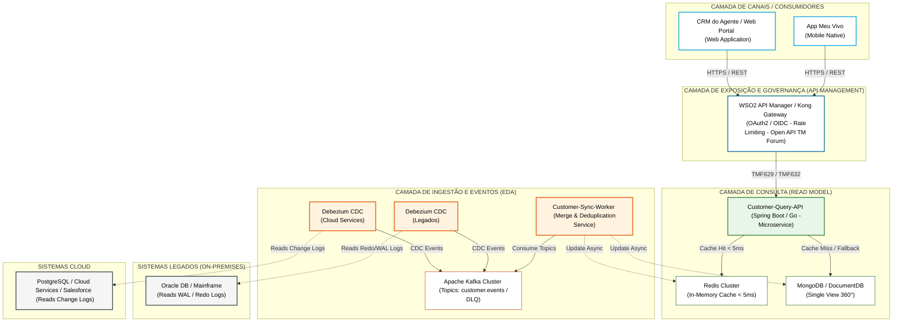

# ADR 001: Consolidação do Cadastro de Clientes/Colaboradores (Ponto Único de Consulta)

## 1. Status
Proposto

## 2. Contexto
Atualmente, as informações cadastrais de clientes e colaboradores da Vivo coexistem e são alteradas em múltiplos sistemas, incluindo o CRM de mercado (Salesforce), sistemas em nuvem e diversos sistemas legados on-premises. A área de Atendimento (CX) demanda uma visão unificada ("melhor dado" / Visão 360°) que possa ser consultada de forma centralizada a partir de canais como o App Meu Vivo e o CRM do Agente. 

Os principais desafios técnicos e arquiteturais são:
1. **Baixíssima Latência:** O tempo de resposta da API de consulta precisa ser inferior a milissegundos (< 5ms no Cache Hit e < 15ms no fallback).
2. **Desacoplamento Total:** O sistema de consulta principal não deve possuir acoplamento com as origens (sistemas legados e cloud não devem "se conhecer").
3. **Consistência e Sincronismo:** Alterações em qualquer ponta devem refletir de forma automatizada e em tempo quase real no ponto único de consulta.
4. **Resiliência:** Falhas, instabilidades e indisponibilidades nos sistemas legados não podem indisponibilizar ou afetar a performance da API de consulta de CX.
5. **Padronização:** A solução deve ser totalmente "APIFICADA", seguindo o modelo orientado aos domínios e contratos globais de telecomunicações.

## 3. Decisão
Decidimos adotar uma **Arquitetura Orientada a Eventos (EDA)** baseada no padrão **CQRS (Command Query Responsibility Segregation)**. Toda a ingestão será realizada via **Change Data Capture (CDC)** de forma não intrusiva, alimentando um modelo híbrido de leitura composto por um repositório NoSQL e um Cache Distribuído em memória (Single Source of Truth).

### Componentes Tecnológicos Escolhidos:
* **Camada de Entrada e Governança:** Utilização de um **API Gateway (WSO2 API Manager / Kong)** atuando como ponto único de entrada desacoplado, tratando autenticação (OAuth2/OIDC), rate limiting e governança.
* **Ingestão via CDC:** Conectores **Debezium (Kafka Connect)** lendo diretamente os logs de transação (Redo/WAL) dos bancos legados (Oracle/Mainframe) e Cloud (PostgreSQL), sem realizar queries nas tabelas de produção.
* **Mensageria e Streaming:** Cluster **Apache Kafka** como barramento de eventos assíncrono para garantir o transporte distribuído, resiliente e persistente das mensagens.
* **Processamento e Sincronização:** O microsserviço **Customer-Sync-Worker** consumirá os tópicos do Kafka, aplicando regras de negócio, enriquecimento, merge e deduplicação cadastral por CPF/CNPJ.
* **Repositório Unificado (Read Model):** Combinação híbrida entre **MongoDB / Amazon DocumentDB** (para armazenar a visão unificada estruturada do cliente em JSON / 360°) e **Redis Cluster** (como cache em memória operando em padrão *Write-Through / Cache-Aside* para respostas abaixo de 5ms).
* **Resiliência:** Implementação do framework **Resilience4j** (*Circuit Breaker* e *Retry*) nas aplicações, isolamento de mensagens inconsistentes via **Dead Letter Queues (DLQ)** no Kafka, e mecanismos de fallback automático no banco NoSQL em caso de *Cache Miss*.
* **Padronização de API:** Modelagem baseada nas especificações OpenAPIs da **TM Forum**, utilizando os contratos canônicos dos domínios necessários.

## 4. Diagrama da Arquitetura de Solução (C4 Model - Nível 2: Contêineres)

O diagrama abaixo ilustra a separação física e lógica em camadas da solução, evidenciando o isolamento completo dos legados por meio da mensageria e o fluxo síncrono de altíssima performance para os canais.



## 5. Consequências

### Positivas (+):
* **Desempenho Sub-Milissegundo:** Leituras diretas via chaves no Redis garantem latências extremamente baixas (< 5ms) para a camada de CX.
* **Isolamento de Carga (Offloading):** Os sistemas legados on-premises e cloud ficam protegidos contra picos de tráfego de consulta gerados pelos canais digitais.
* **Acoplamento Zero:** As origens apenas disponibilizam as alterações em logs transacionais assíncronos. Seus ciclos de vida permanecem 100% independentes do microsserviço de consulta.
* **Resiliência a Falhas:** Caso um sistema de origem falhe, a fila do Kafka retém os eventos gerados. A aplicação de consulta continua respondendo normalmente com a última versão consolidada e estável em cache.
* **Conformidade Global e LGPD:** A padronização de contratos via TM Forum unifica os dados do titular e resolve problemas legais de duplicidade de perfis.

### Negativas (-):
* **Consistência Eventual:** Devido ao fluxo de processamento assíncrono e baseado em streaming de eventos, existe um delay em milissegundos para que uma escrita em um legado reflita no modelo de leitura.
* **Complexidade de Infraestrutura:** Exige maior governança e monitoramento de novos componentes distribuídos (Kafka Connect, Brokers, Clusters NoSQL e Redis), demandando ferramentas sólidas de observabilidade (OpenTelemetry, Prometheus e Grafana).

## 6. Governança & Padronização TM Forum APIs

A adoção dos padrões abertos da **TM Forum** resolve o desafio de fragmentação de dados no ecossistema de Telecom, fornecendo contratos REST/JSON universais que desconectam o front-end dos esquemas legados proprietários.

| API TM Forum | Domínio / Responsabilidade | Recursos & Função Prática |
| :--- | :--- | :--- |
| **TMF629**<br>Customer Management | Papel Comercial do Cliente (Customer Role) | Recurso `/customer`. Gerencia status da conta (Active/Suspended), preferências de contato e vínculo com contas de faturamento. |
| **TMF632**<br>Party Management | Entidade Mestra Real (Individual / Organization) | Recursos `/individual` e `/organization`. Mantém CPF/CNPJ, nome, data de nascimento e documentos oficiais. Base MDM. |
| **TMF637**<br>Product Inventory | Produtos e Serviços Contratados | Recurso `/product`. Mapeia planos, linhas móveis, banda larga, chips e status do catálogo ativo. |
| **TMF666**<br>Account Management | Contas de Faturamento & Cobrança | Recurso `/billingAccount`. Dados de ciclo de faturamento, histórico de faturas e limite de crédito. |

## 7. Mapeamento Técnico de Atributos (Modelo Canônico TMF629)

Para materializar o conceito de "melhor dado" (*Golden Record*) no ponto único de consulta, o **Customer-Sync-Worker** realiza o mapeamento e a higienização dos payloads brutos transformando-os na estrutura canônica da **TMF629**.

### Objeto Principal: `Customer`
*   **`id`** (String): Identificador único global do cliente gerado de forma determinística por hash (ex: baseado no CPF/CNPJ) para evitar duplicidade entre origens.
*   **`href`** (String): URL de auto-referência para acesso direto ao recurso da API (ex: `https://api.vivo.com.br/customerManagement/v4/customer/VIVO-CUST-89324792`).
*   **`status`** (String): Estado comercial do cliente (`Active`, `Suspended`, `Terminated`). Regra: se qualquer legado apontar uma linha ativa, o status global permanece `Active`.
*   **`statusReason`** (String): Justificativa técnica ou comercial do status atual.

### Sub-estruturas e Relacionamentos
*   **`validFor`** (TimePeriod): Período de validade cronológica do vínculo comercial do cliente.
*   **`engagedParty`** (RelatedPartyRef): Vínculo com a entidade mestre real (mapeada na **TMF632**). Garante a amarração do documento único (CPF/CNPJ) e nome civil ao papel comercial do cliente.
*   **`account`** (AccountRef): Lista de referências de contas de faturamento (vínculo com a **TMF666**) mapeando os ciclos financeiros sem acoplamento de tabelas.
*   **`contactMedium`** (Lista de ContactMedium): Contém canais de comunicação (`mediumType`: `Email`, `Mobile`) e flags de prioridade (`preferred`: `true/false`). O Salesforce atua com prioridade de escrita para preferências de contato.

```json
{
  "id": "VIVO-CUST-89324792",
  "href": "https://api.vivo.com.br/customerManagement/v4/customer/VIVO-CUST-89324792",
  "status": "Active",
  "validFor": {
    "startDateTime": "2026-01-15T08:00:00Z"
  },
  "engagedParty": {
    "id": "IND-9921",
    "name": "Maria Silva",
    "@type": "Individual"
  },
  "account": [
    {
      "id": "ACC-998877",
      "description": "Conta Fatura Combo Móvel + Fibra",
      "@referredType": "BillingAccount"
    }
  ],
  "contactMedium": [
    {
      "preferred": true,
      "mediumType": "Mobile",
      "characteristic": {
        "phoneNumber": "11999998888"
      }
    }
  ]
}
```

## 8. Separação de Domínios Cadastrais: Party (TMF632) vs. Customer (TMF629)

### Justificativa de Desacoplamento
Em sistemas tradicionais, dados civis (Nome, CPF) e dados comerciais (Planos, Status) costumam residir misturados no mesmo modelo de dados. Isso gera replicação cadastral indevida quando o cliente adquire múltiplos produtos independentes e impede uma governança sólida de exclusão de dados e privacidade (LGPD).

A separação promovida pelas especificações do **TM Forum** resolve essa fricção arquitetural:
*   **TMF632 (Party / Individual):** Centraliza estritamente o Indivíduo Mestre de forma única no ecossistema (visão de MDM).
*   **TMF629 (Customer):** Modela os papéis comerciais que aquele indivíduo desempenha na empresa (ex: titular de conta residencial, representante legal corporativo), apontando de forma relacional para o registro mestre de Party através do atributo `engagedParty`.


Aqui está um banco abrangente com 20 perguntas técnicas e estratégicas que a banca de arquitetura da Vivo pode fazer sobre a solução proposta, divididas por categorias para facilitar o seu estudo. As respostas são diretas e usam a terminologia correta de mercado.
------------------------------
## 🌐 Camada de Exposição, Governança e TM Forum## 1. Por que usar o WSO2 ou o Kong como API Gateway em vez de expor a API de consulta direto na internet?
Resposta: O API Gateway centraliza a governança. Ele lida com autenticação unificada (OAuth2/OIDC), aplica rate limiting para proteger nossa infraestrutura de ataques ou abusos e nos dá métricas de telemetria em um único ponto, blindando os microsserviços internos.
## 2. Na prática, qual é o ganho real de negócio em adotar a especificação TMF629 (Customer Management)?
Resposta: Redução drástica no Time-to-Market. Ao usar um modelo de dados canônico universal de telecomunicações, qualquer novo canal ou sistema que a Vivo adquirir no futuro não precisará de uma nova integração proprietária; bastará consumir o contrato REST/JSON padrão da TMF629.
## 3. Qual a diferença conceitual e prática entre a TMF632 (Party) e a TMF629 (Customer) no seu desenho?
Resposta: A TMF632 gerencia a entidade mestra real (o indivíduo, CPF, nome civil — foco em MDM e LGPD). A TMF629 gerencia o papel comercial que esse indivíduo desempenha na operadora (o cliente que possui uma conta de fibra ou um plano móvel). Um único Party (TMF632) pode estar vinculado a múltiplos papéis de Customer (TMF629).
## 4. Como sua API de consulta lida com paginação e filtros complexos exigidos pelo CRM dos agentes?
Resposta: Seguindo as diretrizes de design do TM Forum, expomos filtros nativos na query string (ex: GET /customer?status=Active&page=1&size=20). A Customer-Query-API traduz esses parâmetros em consultas indexadas diretamente no MongoDB, evitando trafegar payloads desnecessários na rede.
------------------------------
## 📥 Camada de Ingestão, Eventos e CDC (Apache Kafka / Debezium)## 5. O Debezium pode causar lentidão ou travar os bancos de dados dos sistemas legados da Vivo?
Resposta: Não, pois ele opera em modo "não intrusivo". Em vez de executar queries SELECT nas tabelas de produção, o Debezium lê diretamente os arquivos de log de transação do banco (como o Redo Log do Oracle ou o WAL do PostgreSQL). O impacto em CPU e memória na origem é praticamente zero.
## 6. Como garantir a ordenação estrita dos eventos no Kafka se o mesmo cliente for atualizado várias vezes seguidas?
Resposta: Usamos o CPF ou CNPJ do cliente como a Message Key (chave da mensagem) no Kafka. O Kafka garante que todas as mensagens que possuem a mesma chave caiam estritamente na mesma partição do tópico, assegurando que o Customer-Sync-Worker as processe na ordem exata em que ocorreram na origem.
## 7. O que acontece se o pipeline de CDC falhar e enviar uma mensagem com o esquema quebrado ou corrompido?
Resposta: Implementamos o padrão Dead Letter Queue (DLQ). O Customer-Sync-Worker possui um bloco de try-catch acoplado ao Schema Registry. Se a mensagem vier malformada ou violar o contrato, ela é desviada automaticamente para o tópico de DLQ para análise e reprocessamento posterior, sem travar o processamento das mensagens saudáveis.
## 8. Como evitar que mensagens duplicadas no Kafka (causadas por retentativas de rede) gerem dados inconsistentes na base 360°?
Resposta: O Customer-Sync-Worker opera de forma idempotente. Antes de persistir qualquer alteração, ele checa o identificador do evento e o timestamp. Se o dado que está tentando gravar for igual ou mais antigo do que o dado que já está no MongoDB/Redis, a mensagem é simplesmente descartada como duplicada.
## 9. O que acontece se o volume de eventos no Kafka crescer abruptamente (ex: uma carga em lote nos legados)? Como a arquitetura escala?
Resposta: A escalabilidade do Kafka é horizontal por meio de partições. Nós escalamos o Customer-Sync-Worker criando múltiplas instâncias dentro do Kubernetes (EKS/GKE) configuradas no mesmo Consumer Group. Cada instância assume o processamento de uma partição, dividindo a carga de forma elástica.
------------------------------
## 💾 Camada de Armazenamento e CQRS (Redis + MongoDB)## 10. Explique a estratégia de cache híbrido adotada. Por que usar Redis e MongoDB juntos?
Resposta: Aplicamos o padrão CQRS. O MongoDB é a nossa base NoSQL estruturada de persistência durável, onde guardamos o JSON completo da Visão 360° do cliente. O Redis Cluster funciona como um cache em memória (chave-valor) focado em altíssima frequência. A API busca primeiro no Redis; se houver Cache Miss, ela busca no MongoDB e reidrata o Redis.
## 11. O que é o padrão Cache-Aside indicado na sua solução e como ele se comporta em um Cache Miss?
Resposta: No padrão Cache-Aside, a aplicação de consulta gerencia o cache. Quando ocorre um Cache Miss (o dado não está no Redis), a API vai até o MongoDB, recupera o payload unificado de 360°, responde ao canal solicitante (app/CRM) e, de forma assíncrona, grava uma cópia desse dado no Redis para que a próxima consulta seja imediata.
## 12. Como garantir que o Redis não fique sem memória RAM com milhões de clientes da Vivo cadastrados?
Resposta: Adotamos três estratégias combinadas: primeiro, salvamos no Redis apenas os dados de alta frequência necessários para a tela de atendimento; segundo, configuramos políticas de despejo como LRU (Least Recently Used), que remove os clientes menos consultados; e terceiro, definimos um TTL (Time-To-Live) curto para expiração do dado.
## 13. Qual é o tempo de vida (TTL) ideal para o dado do cliente no Redis e como decidir esse valor?
Resposta: O TTL ideal varia entre 2 e 4 horas para dados de CX. Como temos o Customer-Sync-Worker atualizando o Redis de forma ativa e assíncrona a cada evento que chega do Kafka (Write-Through parcial), o TTL serve apenas como uma garantia para limpar a memória de clientes inativos que não entram no app ou no CRM há muito tempo.
------------------------------
## 🛡️ Resiliência, Falhas e FinOps## 14. Se um sistema legado on-premises da Vivo cair completamente agora, o cliente consegue consultar os dados dele no app Meu Vivo?
Resposta: Sim, consegue. Como a arquitetura é totalmente desacoplada, a Customer-Query-API consome o dado pré-calculado e consolidado que já está no Redis ou MongoDB. O cliente terá acesso à última versão estável do seu cadastro, garantindo 100% de disponibilidade no atendimento mesmo com o legado fora do ar.
## 15. Como o framework Resilience4j protege sua API de consulta contra falhas em cascata?
Resposta: Implementamos o padrão Circuit Breaker. Se as requisições ao Redis começarem a falhar ou apresentar lentidão acima do limite aceitável, o circuito "abre", interrompendo chamadas ao Redis e direcionando o tráfego de leitura de forma imediata (fallback) para o MongoDB, protegendo a saúde da aplicação.
## 16. O que acontece se o Customer-Sync-Worker ficar indisponível por algumas horas? Há perda de dados?
Resposta: Não há perda de dados. O Apache Kafka é um sistema de mensageria persistente em disco. Se o Worker cair, as mensagens de alteração enviadas pelos legados acumulam com segurança nos tópicos do Kafka (gerando Consumer Lag). Assim que o Worker voltar a operar, ele processa o histórico acumulado a partir do último offset salvo.
## 17. Como mitigar o risco de segurança em armazenar dados sensíveis de clientes (PII) no Redis e no MongoDB?
Resposta: Aplicamos criptografia em duas camadas: Encryption at Rest (criptografia em disco usando chaves gerenciadas no KMS para os volumes do MongoDB/Redis) e Encryption in Transit (forçando conexões seguras mTLS / TLS 1.3 entre a API e as bases de dados). Adicionalmente, aplicamos máscaras de dados para campos sensíveis diretamente no API Gateway.
## 18. Como monitorar se o dado está demorando muito para sair do legado e aparecer atualizado no app (latência do pipeline)?
Resposta: Monitoramos o Consumer Lag no Kafka via Prometheus/Grafana, que mede a distância entre a última mensagem produzida e a última mensagem processada pelo Worker. Também injetamos uma métrica de telemetria baseada no timestamp original da transação do banco de origem, calculando o tempo total de tráfego até o cache.
## 19. Qual estratégia de infraestrutura na nuvem pode ser usada para baratear os custos do MongoDB e do Redis em produção?
Resposta: Aplicamos políticas de FinOps, utilizando instâncias baseadas em processadores ARM (como instâncias Graviton na AWS), que oferecem melhor custo-benefício para NoSQL. Para o MongoDB, podemos usar armazenamento em camadas (Tiered Storage), movendo dados de clientes inativos para discos mais baratos automaticamente.
## 20. Se a Vivo decidir substituir um sistema legado por uma nova solução em nuvem no futuro, qual o impacto nessa arquitetura?
Resposta: O impacto é mínimo e restrito à ponta de captura. Bastará plugar o conector do Debezium no novo banco de dados em nuvem para publicar no mesmo tópico do Kafka. A camada de microsserviços de consulta, o Redis, o MongoDB e as APIs canônicas do TM Forum que atendem ao front-end permanecerão intocados, provando o valor do desacoplamento absoluto.
------------------------------


