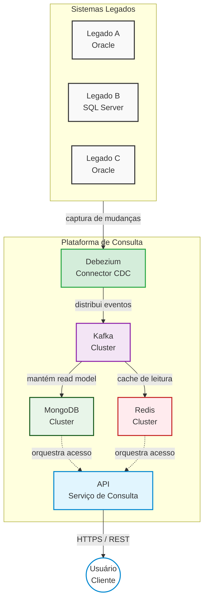

# Arquitetura de Consulta em Tempo Real com CDC, Kafka, MongoDB e Redis
*Diagrama no modelo C4*

## 🗺️ Desenho Visual da Solução (Código Mermaid)

---

## 📦 Componentes Principais

*   **Sistema Legado**: Sistemas existentes que possuem os dados originais.
*   **CDC**: Captura as alterações dos bancos legados.
*   **Kafka**: Distribui os eventos de mudança.
*   **MongoDB**: *Read Model* persistente e otimizado para consultas.
*   **Redis**: Cache de leitura em memória.
*   **API**: Ponto único de consulta para os usuários.

---

## 🏛️ C4 Level 1 - Contexto (Sistema)
*Mostra o sistema em alto nível e seus principais relacionamentos.*

### Elementos e Fluxo
1.  **Sistemas Legados** (Sistema Legado A - Oracle, Sistema Legado B - SQL Server, Sistema Legado C - Oracle) enviam dados para os seus respectivos bancos de dados.
2.  O **CDC (Capture de mudanças)** realiza a *Captura de alterações dos bancos legados*.
3.  O CDC envia os dados para o **Kafka (Event Streaming)**.
4.  O Kafka distribui os *Eventos de mudanças em tempo real*:
    *   Para o **MongoDB (Read Model)**: *Armazena o modelo de leitura consolidado*.
    *   Para o **Redis (Cache de leitura)**: *Acelera as consultas e reduz a carga no MongoDB*.
5.  A **Plataforma de Consulta (API)** consome/consulta dados atualizados do MongoDB e do Redis.
6.  O **Usuário (Cliente)** realiza consultas à Plataforma de Consulta (API).

---

## 🚚 C4 Level 2 - Contêineres (Containers)
*Mostra os contêineres (aplicações e serviços) e suas interações.*

*   **Sistemas Legados**:
    *   Legado A (Oracle)
    *   Legado B (SQL Server)
    *   Legado C (Oracle)
*   **Fluxo de Captura**: Sistemas Legados $
ightarrow$ **Debezium (Connector CDC)** *(via CDC - captura de mudanças)*.
    *   *Descrição do Debezium:* Conecta aos bancos legados e captura as alterações.
*   **Mensageria**: Debezium $
ightarrow$ **Kafka (Cluster)**.
    *   *Descrição do Kafka:* Distribui os eventos de mudança.
*   **Plataforma de Consulta**:
    *   O Kafka distribui os dados para:
        *   **MongoDB (Cluster)**: Mantém o *read model* consolidado.
        *   **Redis (Cluster)**: Cache de leitura em memória.
    *   **API (Serviço de Consulta)**: Recebe as requisições e orquestra o acesso ao cache e ao MongoDB.
*   **Interação com o Cliente**: **Usuário (Cliente)** $
ightarrow$ **API** *(via HTTPS/REST)*.

---

## 🧩 C4 Level 3 - Componentes (Componentes)
*Mostra os principais componentes internos de cada contêiner.*

### Debezium (CDC)
*   Conectores de Banco
*   Processamento de Eventos
*   Schema Registry (opcional)

### Kafka
*   Brokers
*   Tópicos
*   Particionamento
*   Consumers

### MongoDB
*   Repositório de Read Model
*   Índices
*   Replica Set / Sharding

### Redis
*   Cache em Memória
*   TTL (Expiração)
*   Persistência (AOF/RDB)

### API
*   Controladores (REST)
*   Serviços de Negócio
*   Cache Client (Redis)
*   MongoDB Client

---

## 📊 Detalhes Operacionais e Benefícios

### Fluxo de Dados
1. Alterações nos bancos legados (CDC)
2. Eventos no Kafka
3. Atualização do MongoDB (Read Model)
4. Atualização do Redis (Cache)
5. Consulta da API

### Fluxo de Consulta (Cache Hit / Miss)
*   **Cache Hit**:
    *   API $
ightarrow$ Redis (encontrou)
    *   Retorna dado (rápido)
*   **Cache Miss**:
    *   API $
ightarrow$ Redis (não encontrou)
    *   MongoDB (busca o dado)
    *   Grava no Redis (atualiza cache)
    *   Retorna dado

### Benefícios
*   Desacopla os sistemas legados.
*   Evita carga direta nos legados.
*   Oferece alta performance de leitura.
*   Permite reconstrução do cache.
*   Escalável e resiliente.
