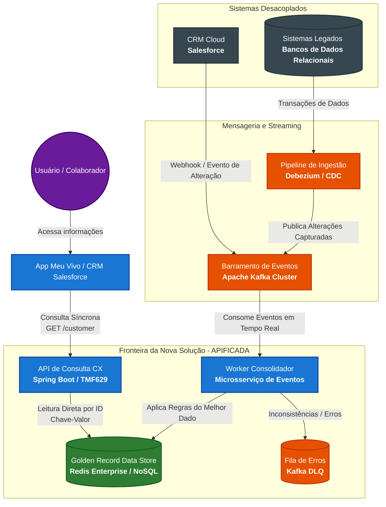

# ADR 001: Consolidação do Cadastro de Clientes/Colaboradores (Ponto Único de Consulta)

## Status
Proposto

## Contexto
Atualmente, as informações cadastrais de clientes e colaboradores da Vivo coexistem e são alteradas em múltiplos sistemas, incluindo o CRM de mercado (Salesforce) e diversos sistemas legados. A área de Atendimento (CX) demanda uma visão unificada ("melhor dado") que possa ser consultada de forma centralizada. 

Os principais desafios técnicos e arquiteturais são:
1. **Baixíssima Latência:** O tempo de resposta da API de consulta precisa ser inferior a milissegundos (< 1ms para cache ou poucos milissegundos em regime de leitura).
2. **Desacoplamento Total:** O sistema de consulta não deve possuir acoplamento com as origens (Salesforce e legados).
3. **Consistência e Sincronismo:** Alterações em qualquer ponta devem refletir de forma automatizada no ponto central.
4. **Resiliência:** Falhas e indisponibilidades nos sistemas legados não podem afetar a disponibilidade da API de consulta de CX.
5. **Padronização:** A solução deve seguir o modelo "apificado" orientado aos domínios de telecomunicações.

## Decisão
Decidimos adotar uma **Arquitetura Orientada a Eventos (EDA)** baseada no padrão **CQRS (Command Query Responsibility Segregation)**, utilizando uma camada de **Change Data Capture (CDC)** para ingestão e um banco de dados NoSQL de alta performance em memória para servir como o *Golden Record Data Store*.

### Componentes Tecnológicos Escolhidos:
* **Ingestão via CDC:** Utilização do **Debezium** acoplado aos bancos de dados dos sistemas legados para capturar eventos de inserção e atualização em tempo real, sem onerar as aplicações legadas.
* **Mensageria e Streaming:** **Apache Kafka (Confluent)** como o broker central de eventos para garantir o transporte assíncrono, distribuído e persistente das alterações de dados.
* **Camada de Processamento (Workers):** Microsserviços desenvolvidos em **Spring Boot (Java)** ou **NestJS** responsáveis por consumir os tópicos do Kafka, tratar concorrências, enriquecer o dado e aplicar as regras de negócio para salvar o "melhor dado".
* **Armazenamento de Consulta (Ponto Único):** Banco de dados **Redis Enterprise** (ou **Amazon DynamoDB** com DAX) atuando como base NoSQL de chave-valor em memória.
* **Resiliência de Código:** Framework **Resilience4j** implementando padrões de *Circuit Breaker* e *Retry* nos microsserviços, associado ao uso de **Dead Letter Queues (DLQ)** no Kafka para isolamento de mensagens corrompidas.
* **Padronização de API:** Implementação baseada na especificação **TMF629 (Customer Management API)** do **TM Forum** no domínio de *Party*.

## Consequências

### Positivas (+):
* **Desempenho Extremo:** A leitura direta no Redis por chave (ID/CPF) garante tempos de resposta na casa dos microsegundos, atendendo com folga o requisito de negócio.
* **Acoplamento Zero:** Os sistemas legados e o Salesforce publicam seus dados e atualizações de forma assíncrona; eles não conhecem a existência da API de consulta e vice-versa.
* **Alta Disponibilidade e Resiliência:** Se um sistema legado ficar offline, o barramento do Kafka retém os eventos. A API de consulta de CX continua funcionando normalmente e servindo os dados já consolidados.
* **Alinhamento com Padrões Globais:** O uso das OpenAPIs do TM Forum garante conformidade com as melhores práticas mundiais de arquitetura para Telecomunicações (Telco).

### Negativas (-):
* **Consistência Eventual:** Como o fluxo de consolidação é assíncrono, há um pequeno *delay* (geralmente de milissegundos) entre a alteração no sistema de origem e o reflexo no ponto único de consulta.
* **Complexidade Operacional:** A introdução de componentes como Kafka, clusters Redis e pipelines de CDC eleva a complexidade de monitoramento (observabilidade), exigindo ferramentas robustas como Prometheus, Grafana e OpenTelemetry.

## Notas de Implementação
* O desenho detalhado dos contêineres e componentes seguirá estritamente a metodologia **C4 Model** (Níveis 1 e 2) na documentação complementar.

## Diagrama de Arquitetura (C4 Model - Nível 2: Contêineres)

O diagrama abaixo ilustra as fronteiras da solução proposta, o desacoplamento absoluto dos sistemas legados/cloud através do barramento de eventos, e a API de consulta consumindo o repositório consolidado em memória.

## Notas Complementares sobre o Desenho:
1. **Camada de Origem:** O **Salesforce** e os **Sistemas Legados** mudaram de papel. Em vez de receberem requisições diretas de consulta, eles tornaram-se estritamente produtores de dados de maneira assíncrona.
2. **Ingestão Inteligente (CDC):** O **Debezium** elimina a necessidade de alterar os códigos-fonte dos sistemas legados. Ele "escuta" os logs dos bancos de dados e despacha as mudanças para o **Kafka** sem gerar impacto de performance ou acoplamento.
3. **Tratamento do "Melhor Dado":** O componente **Worker Consolidador** isola toda a inteligência e as regras de negócio para resolver conflitos e duplicidades, garantindo que o **Redis** guarde estritamente o dado unificado e sanitizado (*Golden Record*).

Se você copiar todo o bloco de código acima e colar no seu repositório Git, o gráfico será desenhado de forma totalmente nativa e interativa. Gostaria de adicionar a listagem técnica de quais campos do **TMF629** seriam mapeados neste diagrama para consolidar os dados do cliente?

